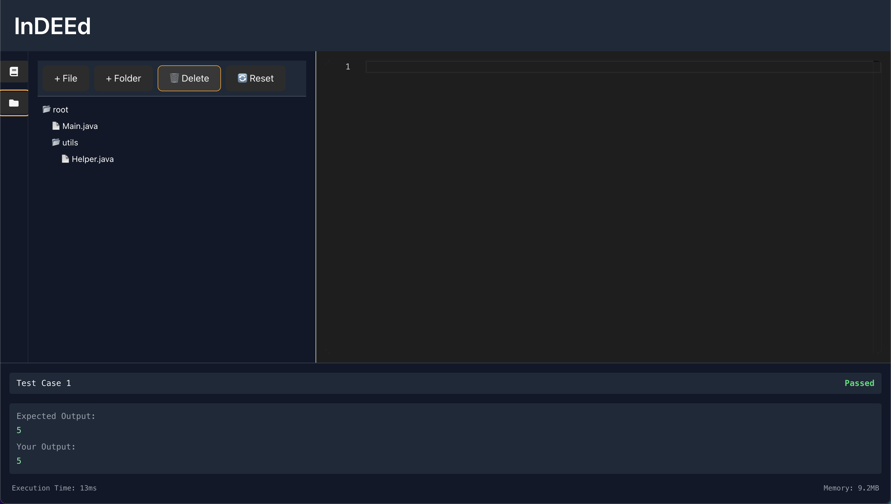

# InDEEd – Intelligent Development Environment for Education

A next-generation coding assignment platform that tracks not just **what** students submit, but **how** they solve problems.

## 🚀 What is this?

InDEEd is a web-based IDE + journaling platform that helps educators understand the full process behind student code submissions. It’s GitHub meets Gradescope – purpose-built for the AI-powered classroom.

**Key Features:**
- ✏️ In-browser code editor with auto-save and journaling
- 🧠 Timeline of code edits to replay the student’s progress
- 📁 File + folder tree with drag-and-drop and nested support
- ⚙️ Secure backend code execution (WIP)
- 📊 Rubric-based grading tools (coming soon)

## 🛠️ Tech Stack

**Frontend:**
- React + Tailwind CSS
- Monaco Editor
- Vite

**Backend:**
- FastAPI (Python)
- Secure containerized execution (Docker)

## 🖼️ Preview

Here's a sneak peek at the current UI:




## 🧪 Getting Started

### Frontend

```bash
cd frontend
npm install
npm run dev
```

### Backend

```bash
cd backend
pip install -r requirements.txt
uvicorn main:app --reload
```

## 📦 Planned Features

* ✅ File system with folders
* ✅ File renaming and drag-drop
* ⏳ Secure Java code execution
* ⏳ Student journaling
* ⏳ Instructor grading dashboard
* ⏳ AI-assist tagging and detection

## 📜 License

MIT – use it, fork it, build on it. Contributions welcome!
